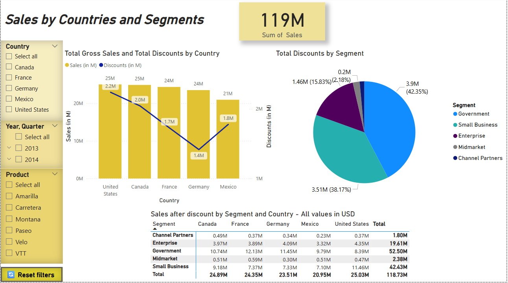

# Power BI Sales and Discounts Dashboard

This repository contains a Power BI dashboard built using the Financial Sample dataset provided by Microsoft. The report enables dynamic exploration of sales and discount performance by country and customer segment.

## 📈 Project Overview

The dashboard visualizes:

- **Total Gross Sales and Discounts by Country** – bar and line chart
- **Total Discounts by Segment** – pie chart
- **Sales After Discount by Segment and Country** – matrix table

It provides interactive filtering capabilities through slicers and a custom reset button for usability.

## 🧩 Key Features

- **Slicers** for filtering by:
  - Country
  - Year/Quarter
  - Product
- **Reset Filters Button** with tooltip:  
  `"Click to reset all filters (+Ctrl)"`
- Tooltips and visuals designed to support executive-level insights
- Conditional formatting to emphasize key figures

## 📁 Dataset

- **Source:** [Financial Sample Excel file](https://learn.microsoft.com/en-us/power-bi/create-reports/sample-financial-download) from Microsoft Learn
- Contains fictional financial data for various countries and product lines

## 🛠️ Tools & Skills

- Power BI
- DAX for calculated measures
- Data modeling and relationship setup
- UX optimization using tooltips and interactivity

## 💡 Use Case

This dashboard supports:
- Sales performance review by region and customer type
- Identifying which segments receive the most discounts
- Post-discount revenue comparison across countries

## 🙋‍♀️ Author

**Adelina Horoń**  
Implementation Services Senior Analyst
[LinkedIn Profile](https://www.linkedin.com/in/adelina-horo%C5%84-9103b316b/)

---

Feel free to clone or fork this project for learning or inspiration.

