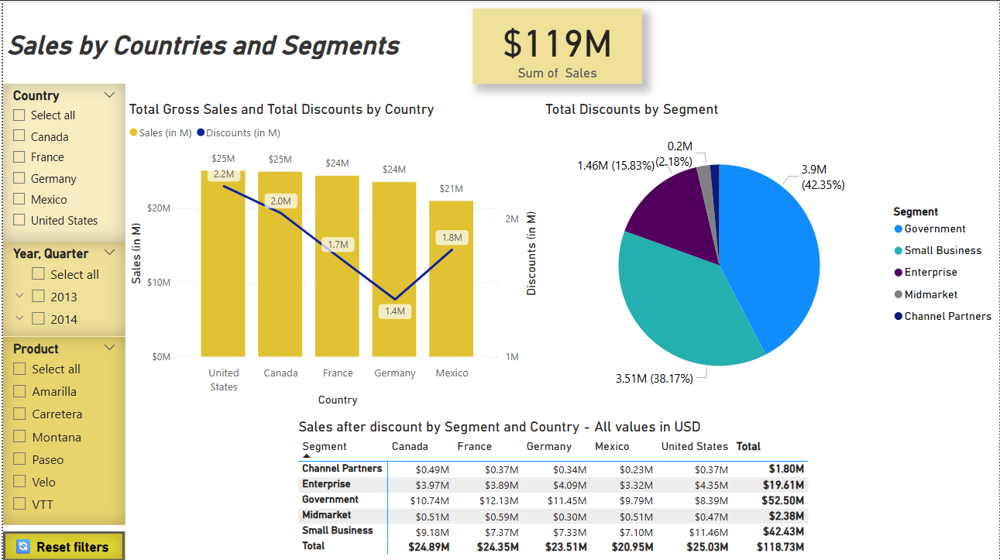
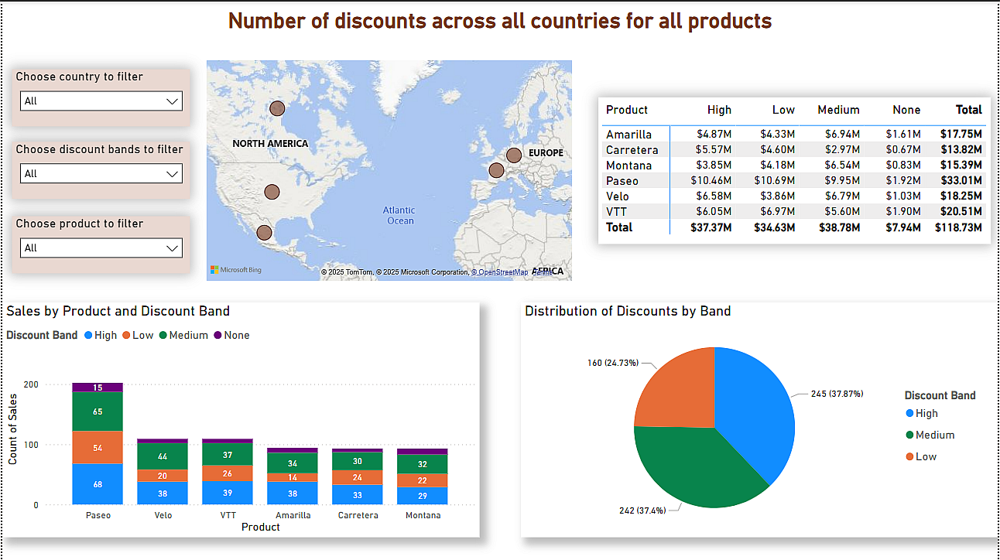

# Power BI Financial Report

This repository contains a Power BI report built using the Financial Sample dataset provided by Microsoft. The `.pbix` file includes **two interactive dashboard pages** that enable dynamic exploration of sales, discounts, and customer segment performance across countries.

  
*Sales & Discounts Overview page*

  
*Product and Discount Band detail view*

## 📈 Project Overview

The report consists of two dashboards:

### 1️⃣ **Sales & Discounts Overview**
- **Total Gross Sales and Discounts by Country** – bar and line chart
- **Total Discounts by Segment** – pie chart
- **Sales After Discount by Segment and Country** – matrix table

### 2️⃣ **Detailed View by Product and Discount Band**
- Interactive analysis by product and discount band
- Map visualization of country-level activity
- Dynamic titles that respond to selected slicer filters

Both pages offer intuitive filtering and consistent styling for executive-level reporting.

## 🧩 Key Features

- **Slicers** for filtering by:
  - Country
  - Year/Quarter
  - Product
  - Discount Band
- **Reset Filters Button** with tooltip:  
  `"Click to reset all filters (+Ctrl)"`
- Tooltips and dynamic visuals tailored for storytelling
- Conditional formatting to highlight key values and trends

## 📁 Dataset

- **Source:** [Financial Sample Excel file](https://learn.microsoft.com/en-us/power-bi/create-reports/sample-financial-download) from Microsoft Learn  
- Contains fictional financial data for multiple countries and product lines

## 🛠️ Tools & Skills

- Power BI Desktop
- DAX for dynamic measures and calculations
- Data modeling and relationship setup
- UX optimization using dynamic titles, slicers, and tooltips

## 💡 Use Cases

These dashboards support:
- Regional sales and discount performance tracking
- Product-level discount impact analysis
- Data-driven decision-making with interactive filtering

## 🙋‍♀️ Author

**Adelina Horoń**  
Implementation Services Senior Analyst  
[LinkedIn Profile](https://www.linkedin.com/in/adelina-horo%C5%84-9103b316b/)

---

Feel free to clone or fork this project for learning or inspiration.
